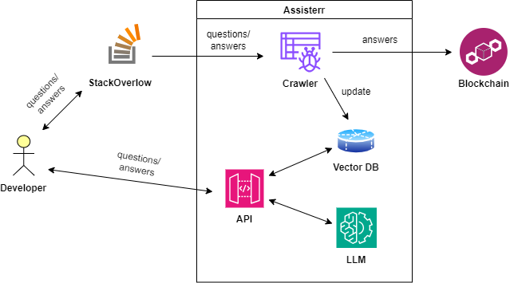
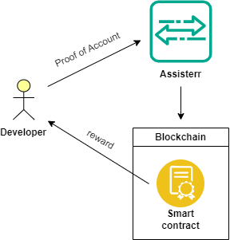
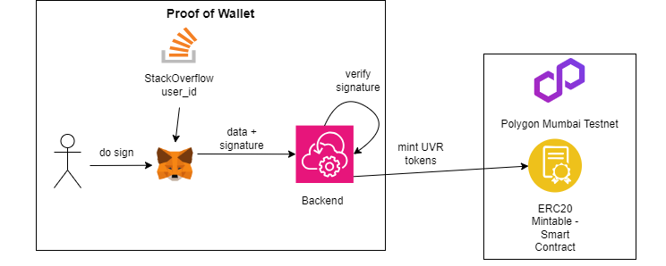

# Autonomous Agent: AI x Web3 Hackathon at ETH Denver 2024
Repository for Assisterr's implementation of solution for **Autonomous Agent: AI x Web3 Hackathon** at **ETH Denver 2024**

More information about the AI x Web3 Hackathon can be found on the following links:
- https://autonomous-agent.devpost.com/
- https://lu.ma/k6dw9jk2
- https://edgeagi.notion.site/Autonomous-Agent-AI-x-Web3-Hackathon-93138eb9bd684195b16c8f6462868074

**Intro**

Our solution is a incentive-driven framework that lays **at the intersection of AI, Web3, and DevTooling** and can be used to incentivize the creation of community-owned AI models.

**Problem**

Developers often struggle to get timely support while building and often ask questions on StackOverflow. This can be a solution, but there is a lack of incentive to provide the answers and evaluate its quality by other contributors.

Over the last year, LLMs have empowered real-time conversational chatbot support, but the problem is getting updates regularly. We aim to solve this by incentivizing regular data inference.

To tackle this challenge, we have built an incentive-driven framework that encourages the community to contribute by answering questions at the StackExchange-style interface.

**Our framework consists from:**

-   **Upvote Reward Token** - UVR token is used to incentivize valuable contributions and their Validation by the community. For the Hackathon, we created at Polygon Mumbai Testnet UVR ERC20 token that is minted as a reward. If a developer wants to claim rewards, he must submit a Proof of Account. That means he needs to prove that he is the owner of the StackOverlow account. That can be done by putting a code in the About section of his StackOverflow account. After that, he would need to provide his address on which UVR token rewards would be sent. To do it, he needs to pass the Proof of Wallet procedure by signing (do sign) his StackOverflow user_id with his Wallet (MetaMask). The UVR tokens would be minted at his wallet address. The amount of tokens minted equals the sum of all upvotes in that particular tag.

-   **RAG model** - The AI part of our solution utilizes the RAG model. Which provides efficient data inference compared to model finetuning. The retriever component is the Pinecone Vector Database, where every vector is a scraped question/answer pair from StackOverflow's "near protocol" tag. Content is categorized by topic/area/programming language and inserted in a database. That also enables **provable training functionality**, since every vector represents a traceable content chunk. When a developer asks a question, a similarity search is performed on a vector database where question/answer semantics are taken into consideration. With the most similar answers, LLM (ChatGPT 4.0) is poked to structure a fine answer to the developer.

